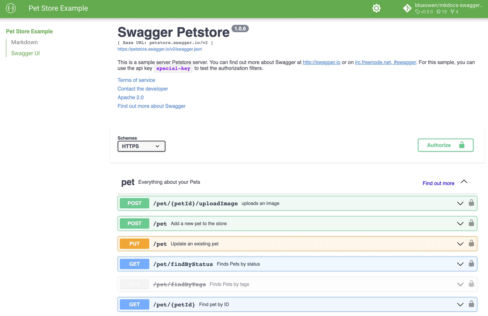

# MkDocs Swagger UI Tag

<a target="_blank" href="https://pypi.org/project/mkdocs-swagger-ui-tag"></a>
<a target="_blank" href="https://pypi.org/project/mkdocs-swagger-ui-tag"></a>
<a target="_blank" href="https://codecov.io/gh/blueswen/mkdocs-swagger-ui-tag"></a>

一个 MkDocs 插件支持在页面中添加[Swagger UI](https://github.com/swagger-api/swagger-ui)。

## 特征

1. OpenAPI Specification file from online over URL or static file in docs
2. All dependencies are using static files handled by plugin not from CDN, especially suitable for those documents been deployed in the intranet
3. Multiple Swagger UI in same page
4. Synchronized dark mode with [Material for MkDocs](https://squidfunk.github.io/mkdocs-material/)
5. Configure [Swagger UI configuration](https://swagger.io/docs/open-source-tools/swagger-ui/usage/configuration/) through plugin options and tag attributes
6. Support multiple OAS in single Swagger UI with top bar selector
7. Support Swagger UI [initOAuth](https://swagger.io/docs/open-source-tools/swagger-ui/usage/oauth2/) method

## 依赖性

1. Python Package
    1. beautifulsoup4>=4.11.1
2. [Swagger UI dist](https://www.npmjs.com/package/swagger-ui-dist) javascript file and css file
    1. swagger-ui-dist==4.14.0

## 用法

1. 从 PYPI 安装插件

    ```bash
    pip install mkdocs-swagger-ui-tag
    ```

2. 在你的 mkdocs 中添加`swagger-ui-tag`插件。Yml 插件部分:

    ```yaml
    plugins:
        - swagger-ui-tag
    ```

3. 在 markdown 中添加`swagger-ui` 标签，以包括 Swagger UI

    ```html
    <swagger-ui src="https://petstore.swagger.io/v2/swagger.json" />
    ```

    

4. 你可以通过在 mkdocs.yml 中传递选项来定制插件，查看[options](./options/)的详细信息:

    ```yaml
    plugins:
        - swagger-ui-tag:
              background: White
    ```

    | Options                | Type              | Default          | Description                                                                                                                                                                                                                                                                                                                                                                               |
    | ---------------------- | ----------------- | ---------------- | ----------------------------------------------------------------------------------------------------------------------------------------------------------------------------------------------------------------------------------------------------------------------------------------------------------------------------------------------------------------------------------------- |
    | background             | String            | ""               | Swagger UI iframe body background attribute value. You can use any css value for background for example "#74b9ff" or "Gainsboro" or "" for nothing.                                                                                                                                                                                                                                       |
    | docExpansion           | String            | "list"           | Controls the default expansion setting for the operations and tags. It can be "list" (expands only the tags), "full" (expands the tags and operations) or "none" (expands nothing).                                                                                                                                                                                                       |
    | filter                 | String or Boolean | False            | If set, enables filtering. The top bar will show an edit box that you can use to filter the tagged operations that are shown. Can be Boolean to enable or disable, or a string, in which case filtering will be enabled using that string as the filter expression. Filtering is case sensitive matching the filter expression anywhere inside the tag.                                   |
    | syntaxHighlightTheme   | String            | "agate"          | [Highlight.js](https://highlightjs.org/static/demo/) syntax coloring theme to use. It can be "agate", "arta", "monokai", "nord", "obsidian" or "tomorrow-night"                                                                                                                                                                                                                           |
    | tryItOutEnabled        | Boolean           | False            | Controls whether the "Try it out" section should be enabled by default.                                                                                                                                                                                                                                                                                                                   |
    | oauth2RedirectUrl      | String            |                  | "/assets/swagger-ui/oauth2-redirect.html"相对于 mkdocs.yml 中的 site_url 的绝对 URL，或者站点上没有 site_url 的文档根路径。“[https://blueswen.github.io/mkdocs-swagger-ui-tag/assets/swagger-ui/oauth2-redirect.html]”。 OAuth redirect URL.                                                                                                                                              |
    | supportedSubmitMethods | Array             | All Http Methods | Array=["get", "put", "post", "delete", "options", "head", "patch", "trace"]. List of HTTP methods that have the "Try it out" feature enabled. An empty array disables "Try it out" for all operations. This does not filter the operations from the display.                                                                                                                              |
    | validatorUrl           | String            | "none"           | By default, the validation is disabled. When setting with "https://validator.swagger.io/validator", Swagger UI attempts to validate specs against swagger.io's online validator in multiple OAS Swagger UI. You can use this parameter to set a different validator URL, for example for locally deployed validators ([Validator Badge](https://github.com/swagger-api/validator-badge)). |
    | extra_css              | Array             | []               | Extra CSS files in your `docs_dir` included in Swagger UI iframe target html file.                                                                                                                                                                                                                                                                                                        |

## 怎么运行的

1. 将 Swagger UI 脚本文件复制到`site/assets/javascripts/`目录，CSS 文件复制到`site/assets/stylesheets/`目录，将[默认 Oauth2 redirect html](https://github.com/blueswen/mkdocs-swagger-ui-tag/blob/main/mkdocs_swagger_ui_tag/swagger-ui/oauth2-redirect.html)复制到`site/assets/swagger-ui/`目录
2. 搜索所有 swagger-ui 标记，然后将它们转换为 iframe 标记，并使用给定的 OpenAPI 规范 src 路径和选项生成 iframe 目标 html

## 执照

该项目在 MIT 许可证下获得许可-请参阅[License .md](https://github.com/Blueswen/mkdocs-swagger-ui-tag/blob/main/LICENSE)文件了解详细信息。

## 参考

1. [Amoenus Swagger 黑暗主题](https://github.com/Amoenus/SwaggerDark/):来源的黑暗模式 css
